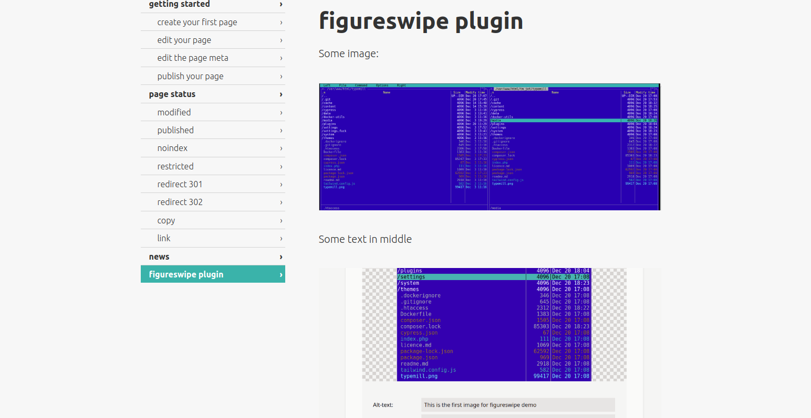
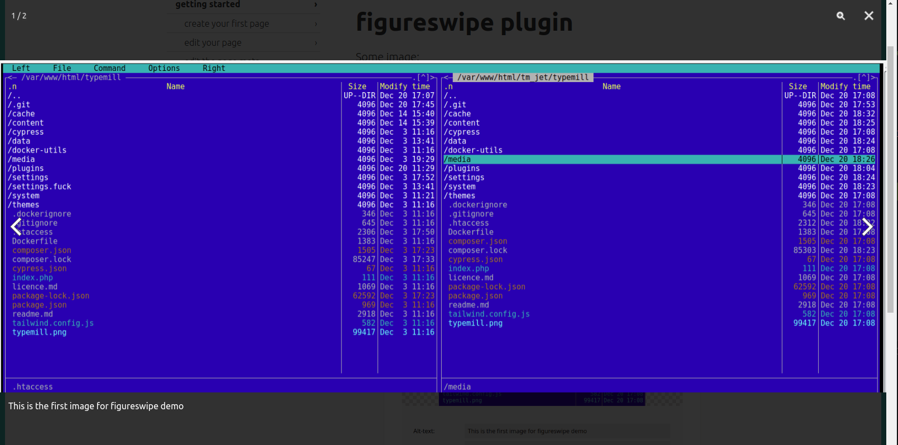
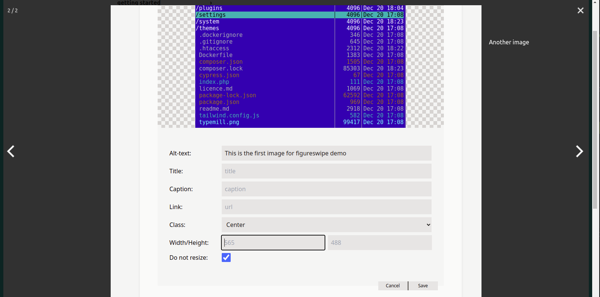
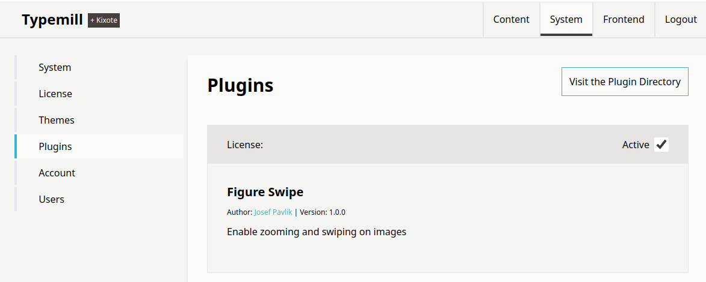
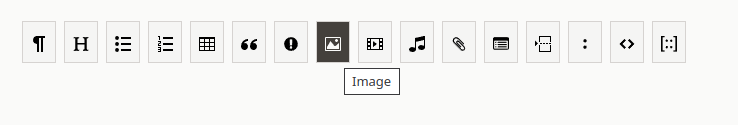
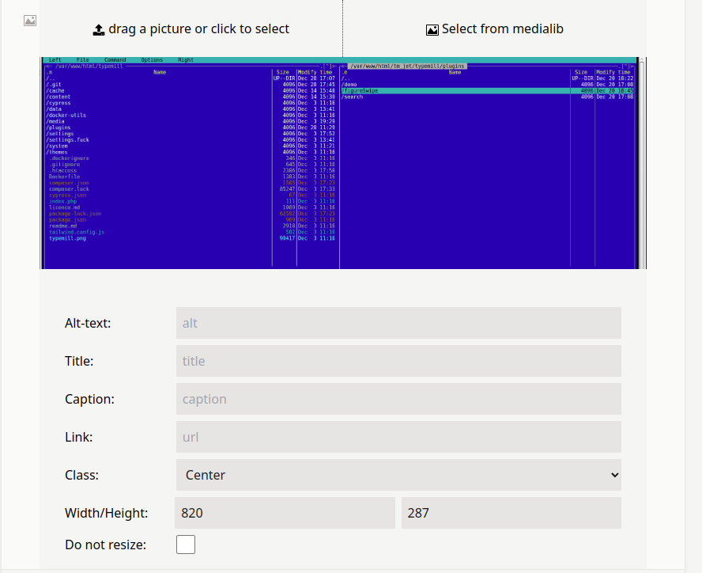
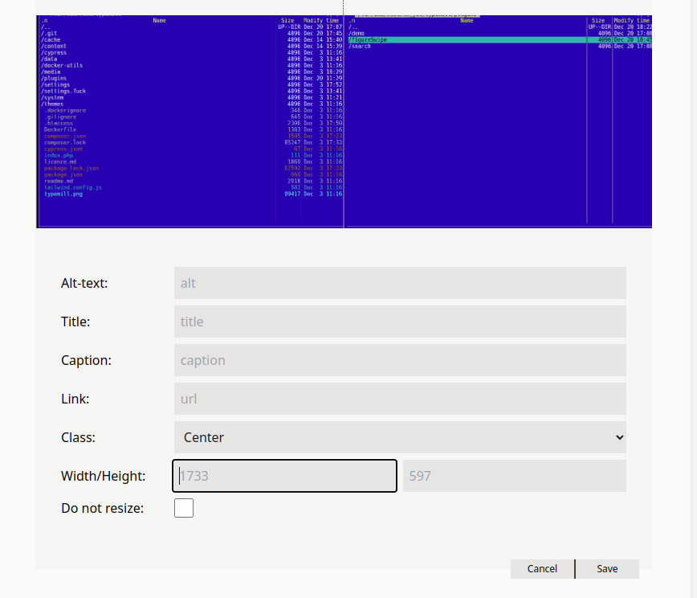
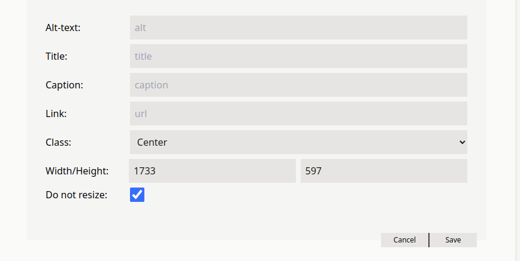
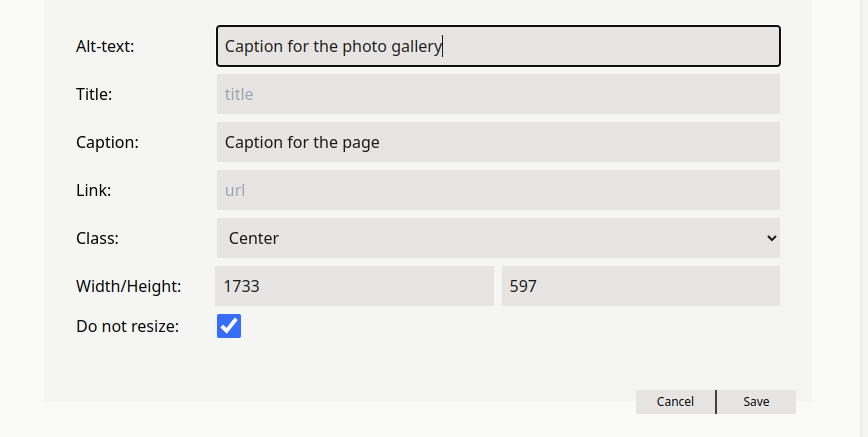

# figureSwipe plugin for typemill

The plugin allows you to zoom in the figures in the page and show them one after other like photo gallery.
The text from the attribute **alt** of the figure is shown below or aside the picture.

(c) 2024 Josef Pavlik [source on github](https://github.com/josefpavlik/typemill-plugin-figureswipe)
License: MIT

Based on [PhotoSwipe](https://github.com/dimsemenov/PhotoSwipe/) and [photoswipe-dynamic-caption-plugin](https://github.com/dimsemenov/photoswipe-dynamic-caption-plugin)

### A page of typemill documentation

The first image is large, so it's zoomed out, it's not possible to read the text on

### Clicking on the figure, it zooms in and shows it on full page of browser

If the resolution of the image is larger than the window of browser, the second click zooms it to full resolution and it's possible to pan the image.

### Navigating on left or right arrow or swiping left and right you can show another figures of the page


# Installation
clone this repository to your plugins directory of typemill

```
cd <path_to_typemill>/plugins
git clone https://github.com/josefpavlik/typemill-plugin-figureswipe.git figureSwipe
cd figureSwipe
./prepare_libs
```

## Typemill older than V2.13 needs a patch
Typemill before V2.13 needs a small patch to work with this plugin. Please update typemill to version 2.13 or above. If you want to use some older typmill, you should apply the patch typemill.patch.

``` patch << typemill.patch ```

## Activate the plugin
Go to the *System* page and select the *Plugin* on the left menu
Search for the figureSwipe plugin and enable it

That's all.

## Insert a large image to page
The images must be inserted with full resolution. The resolution of the image must be declared in attributes. You must set the flag "do no resize" too.

* click on the Image icon of the command bar

* Drag image to the page

* The width and height are precompiled to fixed (smaller values). You must select and delete the width. This also deletes the height

* Now set the flag "Do not resize". The width and height will be compiled with real size of the image

* If you want, compile the *Caption* (for the listing) and the *Alt-text* attribute for the text in zoom-in mode

* Save
  
